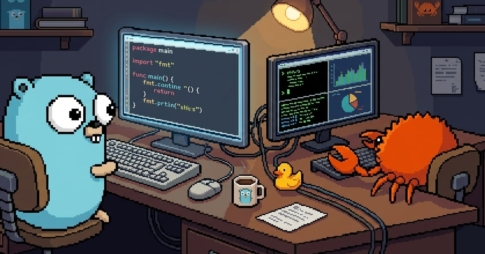

# Portal Space

2D 픽셀 멀티플레이어 협업 공간

> A 2D pixel multiplayer co-coding space built with SvelteKit, Bun, and Phaser — exposed via [Portal Tunnel](https://github.com/gosuda/portal-tunnel).



## 주요 기능

- **실시간 멀티플레이어** — WebSocket 기반, 최대 20명 동시 접속
- **채팅** — 게임 내 실시간 채팅 + 말풍선 (글로벌 + 존 채팅)
- **화이트보드** — Y.js + Konva.js 기반 실시간 협업 드로잉
- **이모트** — 이모지 이모트 표현
- **캐릭터 커스텀** — 아바타 색상(신체/눈/발) 커스터마이징
- **상태 표시** — online/away/dnd + 커스텀 상태 메시지
- **모바일 지원** — 반응형 UI + 터치 조이스틱
- **줌** — 픽셀퍼펙트 이산 줌 (데스크톱)
- **NAT 통과** — Portal Tunnel로 방화벽 뒤에서도 공개 URL 자동 생성

## 기술 스택

| 계층 | 기술 |
|------|------|
| Frontend | SvelteKit 2, Svelte 5, TypeScript, Vite |
| Game Engine | Phaser 3 |
| Backend | Bun (WebSocket + 정적 파일 서빙) |
| 실시간 통신 | Bun 네이티브 WebSocket |
| 화이트보드 동기화 | Y.js (CRDT) |
| 데이터베이스 | bun:sqlite (WAL 모드) |
| 네트워크 노출 | Portal Tunnel CLI (`portal expose`) |
| 패키지 매니저 | Bun |

## 시작하기

### Prerequisites

- [Bun](https://bun.sh/)
- [Portal Tunnel CLI](https://github.com/gosuda/portal-tunnel) (프로덕션 배포 시)

### 설치

```bash
git clone https://github.com/1ncursio/portal-space.git
cd portal-space/frontend && bun install
```

### 개발

두 개의 터미널이 필요합니다.

```bash
# 터미널 1: Bun WebSocket 서버 (포트 3001)
bun run dev:server

# 터미널 2: Vite 프론트엔드 개발 서버
bun run dev:frontend
```

Vite가 `/ws`, `/peer` 요청을 `localhost:3001`로 프록시합니다.

### 빌드

SvelteKit을 정적 빌드합니다.

```bash
bun run build
```

### 프로덕션 실행

```bash
cd frontend
bun run build
bun run server.ts
```

## 배포

Portal Tunnel로 공개 URL을 생성합니다.

```bash
bun run deploy
```

내부적으로 프론트엔드 빌드 후 Bun 서버를 시작하고 `portal expose`로 공개합니다.

```bash
# 또는 수동으로:
cd frontend && bun run build
bun run server.ts &
portal expose 3000 --name "my-space" --discovery=true
```

## 프로젝트 구조

```
portal-space/
├── scripts/
│   └── deploy.ts              # 배포 스크립트 (빌드 + 서버 + 터널)
├── frontend/
│   ├── server.ts              # Bun HTTP/WebSocket 서버 진입점
│   ├── src/
│   │   ├── server/
│   │   │   ├── protocol.ts    # 메시지 프로토콜 + 검증 함수
│   │   │   ├── storage.ts     # bun:sqlite 래퍼
│   │   │   ├── hub.ts         # 룸 매니저
│   │   │   ├── room.ts        # 게임 월드 로직 (충돌, 존, 채팅)
│   │   │   ├── client.ts      # 접속별 플레이어 상태
│   │   │   └── yjs-relay.ts   # Y.js 바이너리 릴레이
│   │   ├── routes/            # SvelteKit 라우트
│   │   ├── lib/
│   │   │   ├── components/    # UI 컴포넌트
│   │   │   ├── game/          # Phaser 게임 로직
│   │   │   ├── stores/        # Svelte 스토어
│   │   │   ├── whiteboard/    # Y.js + Konva.js 화이트보드
│   │   │   ├── network.ts     # WebSocket 클라이언트
│   │   │   └── types.ts       # 공유 타입 정의
│   │   └── app.css
│   └── build/                 # 빌드 출력 (정적 파일)
└── docs/
    ├── ROADMAP.md
    └── WHITEBOARD-SPEC.md
```

## 설정

서버는 환경변수로 설정합니다.

| 환경변수 | 기본값 | 설명 |
|----------|--------|------|
| `PORT` | `3000` | HTTP/WebSocket 포트 |
| `DB_PATH` | `portal-space.db` | SQLite 데이터베이스 경로 |

Portal Tunnel 설정은 `portal expose --help`를 참조하세요.

## 라이선스

[Apache License 2.0](LICENSE)
